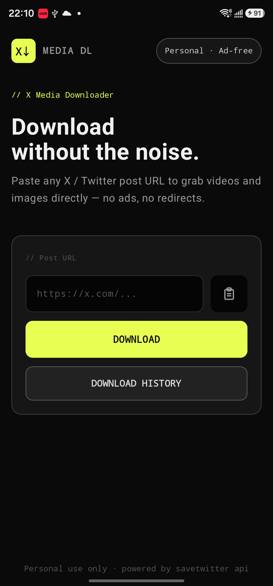
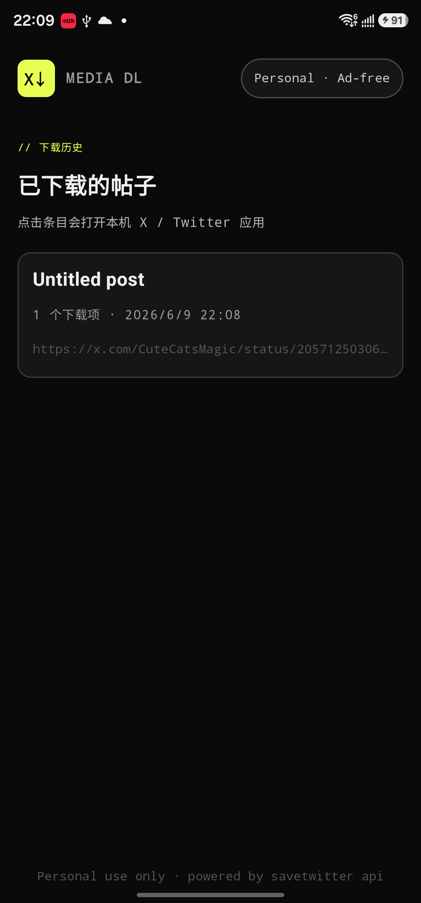
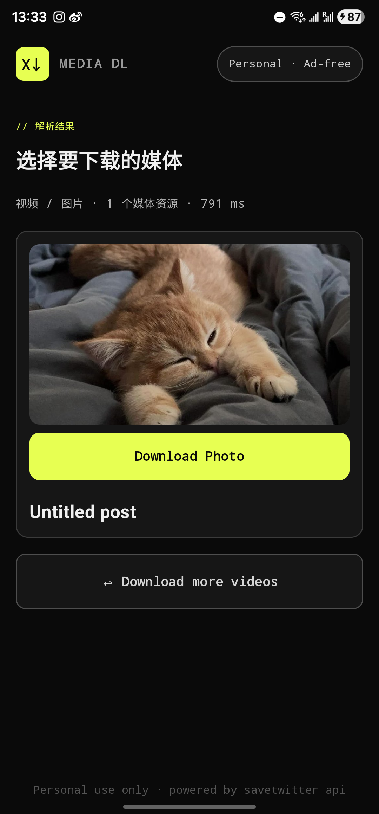
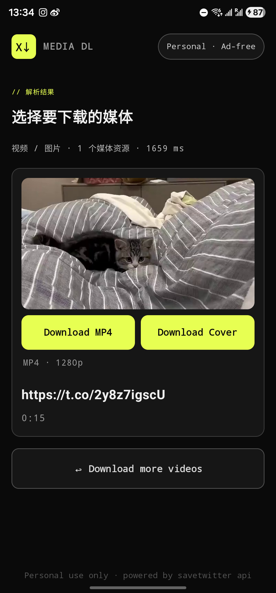

# X Media DL Compose

[中文](#中文) · [English](#english)

<p align="center">
  
</p>

<p align="center">
  <strong>无广告 X/Twitter 媒体下载实验 App · Ad-free X/Twitter media downloader experiment</strong>
</p>

Public repository: https://github.com/wildcatDownstairs/x-media-dl-compose
Web demo: https://wildcatdownstairs.github.io/x-media-dl-compose/

## 中文

X Media DL Compose 是一个个人使用和学习用途的 X/Twitter 媒体下载实验项目。仓库里包含两个部分：

- Android 原生 App：Kotlin + Jetpack Compose 实现。
- 网页版原型：部署到 GitHub Pages，方便在浏览器和 iPhone 上直接访问。

### 功能

- 从剪贴板粘贴 X/Twitter 帖子链接。
- 通过 SaveTwitter 的解析接口读取可下载媒体。
- 每个视频只显示最高质量 MP4 下载项。
- 视频封面下载与视频下载并排显示。
- 独立图片单独显示下载按钮。
- Android App 会把视频和图片保存到系统媒体库，方便在相册里查看。
- 提供 Android Adaptive Icon：独立 foreground、background、monochrome 图层，避免厂商桌面二次裁切时切边。
- 使用本地 SQLite 记录下载历史，同一媒体再次下载前会提示确认，不会删除相册里已有文件。
- 下载历史按帖子聚合展示，标题最多两行，点击条目会打开本机 X / Twitter 应用。
- 支持 Android 返回手势从结果页回到输入页。
- 结果页底部 `Download more videos` 会优先检查剪贴板；如果有新的 X/Twitter 帖子链接，会直接刷新解析，否则返回首页。

### App 截图

以下截图来自已连接的 Android 真机，示例链接：

- 图片帖：https://x.com/CuteCatsMagic/status/2057125030610301155?s=20
- 视频帖：https://x.com/CuteCatsMagic/status/2057319463423181065?s=20

| 一级页面 | 下载历史 |
| --- | --- |
|  |  |

| 图片下载页 | 视频下载页 |
| --- | --- |
|  |  |

### Adaptive Icon

Android App 使用 Adaptive Icon，而不是只提供一张成品图：

- `app/src/main/res/drawable/ic_launcher_foreground.xml` - 前景图层，留有安全边距，不包含预裁切圆角、圆形底、外框或阴影。
- `app/src/main/res/values/colors.xml` - 背景色图层。
- `app/src/main/res/drawable/ic_launcher_monochrome.xml` - 单色图层，供支持主题图标的系统使用。
- `app/src/main/res/mipmap-anydpi-v26/ic_launcher.xml` - adaptive icon 入口。

设计依据参考 Android 官方 Adaptive Icon 文档：https://developer.android.com/develop/ui/compose/system/icon_design_adaptive?hl=en

### Android 构建

环境要求：

- Android Studio
- JDK 17
- Android SDK 35
- 一台 Android 真机或模拟器

先创建本地 `local.properties`，指向你的 Android SDK：

```properties
sdk.dir=C\:\\Users\\your-name\\AppData\\Local\\Android\\Sdk
```

构建 debug APK：

```bash
./gradlew :app:assembleDebug
```

Windows：

```powershell
.\gradlew.bat :app:assembleDebug
```

安装：

```bash
adb install -r app/build/outputs/apk/debug/app-debug.apk
```

### 网页版

GitHub Pages 发布目录是 `docs/`。它是一个静态网页，适合公开访问和搜索引擎索引。

注意：GitHub Pages 没有后端服务。网页版会尝试从浏览器直接请求 SaveTwitter 的解析接口；如果上游接口不允许跨域访问，网页版会提示需要代理服务。Android App 不受这个限制，因为它从原生网络层发起请求。

### 目录结构

- `app/` - Kotlin + Jetpack Compose Android App，按 MVVM 拆分为 `viewmodel`、`ui`、`data`、`network`、`download`、`utils`、`model`。
- `docs/` - GitHub Pages 静态网页。
- `index.html` - 早期单文件 HTML 原型。
- `server.mjs` - 本地 HTML 原型使用的 Node 代理服务。

### 免责声明

本项目用于个人学习和实验。请尊重内容所有者权益和相关服务条款。解析逻辑依赖第三方 SaveTwitter 接口，该接口的可用性和返回格式可能随时变化。

## English

X Media DL Compose is a personal-use and learning-oriented experiment for downloading media from public X/Twitter post links. The repository contains two parts:

- Native Android app built with Kotlin and Jetpack Compose.
- Web prototype deployed with GitHub Pages for public access and browser testing.

### Features

- Paste an X/Twitter post URL from the clipboard.
- Resolve downloadable media through the SaveTwitter endpoint.
- Show only the highest-quality MP4 option for each video.
- Show video cover downloads next to their video button.
- Show standalone photo downloads separately.
- Save Android downloads into the system media library so they appear in the gallery.
- Provide Android Adaptive Icon layers: foreground, background, and monochrome.
- Store download history locally with SQLite and ask for confirmation before re-downloading an already recorded media item.
- Group history by post, show each title with two-line ellipsis, and open the local X / Twitter app when a history item is tapped.
- Handle Android back gestures from the result page back to the input page.
- Let `Download more videos` check the clipboard first: if a new X/Twitter post URL is available, resolve it in place; otherwise return to the home screen.

### App Screenshots

The screenshots below were captured from a connected Android device using these sample links:

- Photo post: https://x.com/CuteCatsMagic/status/2057125030610301155?s=20
- Video post: https://x.com/CuteCatsMagic/status/2057319463423181065?s=20

| Home | Download history |
| --- | --- |
|  |  |

| Photo result | Video result |
| --- | --- |
|  |  |

### Adaptive Icon

The Android app uses Adaptive Icon layers instead of a single pre-composed bitmap:

- `app/src/main/res/drawable/ic_launcher_foreground.xml` - foreground layer with safe margins and no pre-clipped rounded shape, circular background, frame, or shadow.
- `app/src/main/res/values/colors.xml` - background color layer.
- `app/src/main/res/drawable/ic_launcher_monochrome.xml` - monochrome layer for themed icon support.
- `app/src/main/res/mipmap-anydpi-v26/ic_launcher.xml` - adaptive icon entry.

Reference: Android's official Adaptive Icon documentation: https://developer.android.com/develop/ui/compose/system/icon_design_adaptive?hl=en

### Android Build

Requirements:

- Android Studio
- JDK 17
- Android SDK 35
- A connected Android device or emulator

Create a local `local.properties` file pointing to your Android SDK:

```properties
sdk.dir=C\:\\Users\\your-name\\AppData\\Local\\Android\\Sdk
```

Build the debug APK:

```bash
./gradlew :app:assembleDebug
```

On Windows:

```powershell
.\gradlew.bat :app:assembleDebug
```

Install:

```bash
adb install -r app/build/outputs/apk/debug/app-debug.apk
```

### Web Version

The GitHub Pages site is published from `docs/`. It is a static page intended for public access and search indexing.

Note: GitHub Pages does not provide a backend. The web page attempts to call the SaveTwitter resolver directly from the browser. If the upstream endpoint blocks cross-origin browser requests, the web version will show a proxy-required message. The Android app is not affected because it uses native networking.

### Project Structure

- `app/` - Kotlin + Jetpack Compose Android app, split into `viewmodel`, `ui`, `data`, `network`, `download`, `utils`, and `model`.
- `docs/` - GitHub Pages static website.
- `index.html` - Early single-file HTML prototype.
- `server.mjs` - Local Node proxy used during the HTML prototype phase.

### Disclaimer

This project is intended for personal learning and experimentation. Respect content owners' rights and the terms of the services involved. The resolver depends on a third-party SaveTwitter endpoint, so availability and response formats may change outside this project's control.
